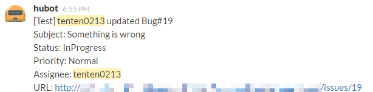
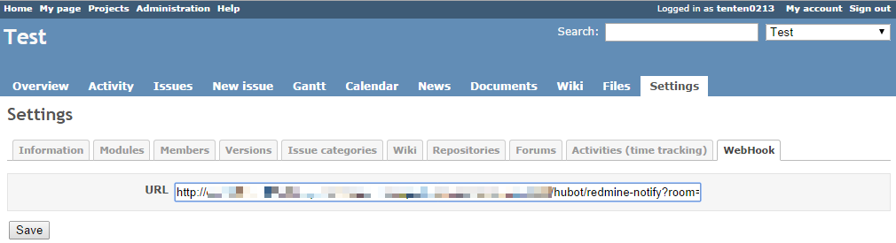

# hubot-redmine-notifier

Notifies about Redmine creating and updating tickets.

## Getting Started

### Hubot
1. Install the module: `npm install --save hubot-redmine-notifier`
2. Add it `hubot-redmine-notifier` to your external-scripts.json file in your hubot directory

### Redmine
1. Install [Redmine Webhook Plugin](https://github.com/suer/redmine_webhook) to your Redmine.
2. Add hubot's endpoint to Redmine Project - Settings - WebHook - URL `http://<hubot-host>:<hubot-port>/hubot/redmine-notify?room=<room>` (see Screenshot)

## License
Licensed under the MIT license.

This script created with reference to the [halkeye/hubot-jenkins-notifier](https://github.com/halkeye/hubot-jenkins-notifier).
